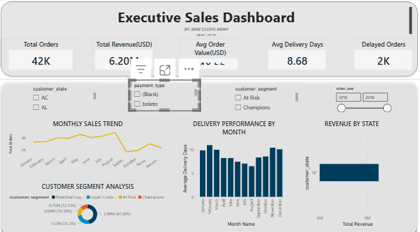
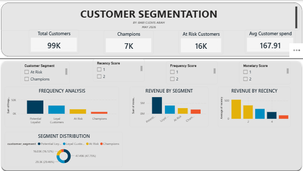
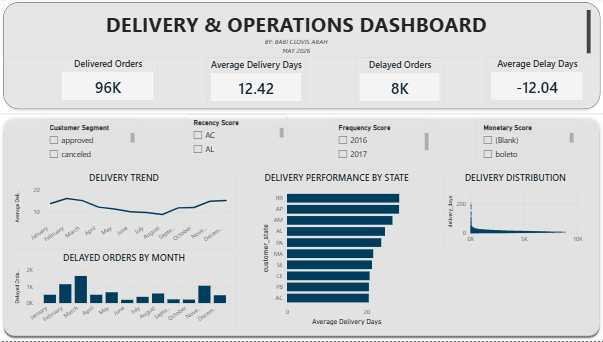

# Olist Cloud ETL & Analytics Pipeline

## Overview

This project is an end-to-end cloud analytics pipeline built using Python, SQL, Google Cloud Platform, and Power BI to analyze the Brazilian Olist e-commerce dataset.

The project demonstrates modern data analytics and business intelligence workflows including:

- ETL pipeline development
- Cloud data storage
- SQL data transformation
- Data warehouse concepts
- Business KPI reporting
- Customer segmentation analysis
- Interactive Power BI dashboarding

The solution processes and analyzes over 100k+ e-commerce transactions to generate actionable business insights.

---

# Project Objectives

The goal of this project is to build a scalable cloud-based analytics platform capable of:

- Ingesting raw e-commerce data
- Cleaning and transforming datasets
- Storing data in cloud infrastructure
- Creating analytics-ready tables
- Building business intelligence dashboards
- Performing customer segmentation analysis

---

# Technology Stack

| Tool | Purpose |
|------|----------|
| Python | ETL & Data Processing |
| Pandas | Data Cleaning & Analysis |
| SQL | Data Transformation |
| Google Cloud Storage | Cloud Data Lake |
| BigQuery | Cloud Data Warehouse |
| Power BI | Dashboard Development |
| Jupyter Notebook | Development Environment |
| Git & GitHub | Version Control |

---

# Project Architecture

```text
Raw CSV Data
      ↓
Python ETL Pipeline
      ↓
Google Cloud Storage
      ↓
BigQuery Data Warehouse
      ↓
SQL Transformations
      ↓
Analytics Tables
      ↓
Power BI Dashboards
```

---

# Business Questions Answered

This project helps answer key business questions such as:

- Which customers generate the highest revenue?
- What are the top-selling product categories?
- Which regions experience the most delivery delays?
- Which customer segments drive repeat purchases?
- How does revenue trend over time?
- Which sellers perform best?
- What operational bottlenecks impact delivery performance?

---

# Dashboard Preview

## Executive Sales Dashboard



---

## Customer Segmentation Dashboard



---

## Delivery Operations Dashboard



---

# Key Features

- End-to-end ETL pipeline
- Cloud-based data architecture
- Data cleaning and transformation workflows
- KPI reporting dashboards
- RFM customer segmentation
- Interactive business intelligence reporting
- Sales performance analytics
- Delivery operations analysis

---

# Dataset

Dataset used:
- Brazilian E-Commerce Public Dataset by Olist

The dataset contains:
- Orders
- Customers
- Sellers
- Products
- Payments
- Reviews
- Geolocation data

---

# Repository Structure

```text
olist-cloud-etl-pipeline/
│
├── data/
│
├── scripts/
│
├── images/
│   ├── executive_sales_dashboard.png
│   ├── customer_segmentation_dashboard.png
│   └── delivery_operations_dashboard.png
│
├── notebooks/
│
├── README.md
├── requirements.txt
└── .gitignore
```

---

# Setup Instructions

## Clone Repository

```bash
git clone https://github.com/YOUR_USERNAME/olist-cloud-etl-pipeline.git
```

---

## Install Dependencies

```bash
pip install -r requirements.txt
```

---

## Run ETL Pipeline

```bash
python etl_pipeline.py
```

---

# Future Improvements

Planned future enhancements include:

- Apache Airflow orchestration
- dbt transformation workflows
- Docker containerization
- Real-time streaming ingestion
- Machine learning forecasting models
- Automated cloud deployment
- CI/CD pipeline integration

---

# Skills Demonstrated

- Data Engineering
- ETL Development
- Cloud Analytics
- SQL Analytics
- Data Modeling
- Data Visualization
- Business Intelligence
- Customer Segmentation
- Dashboard Development

---

# Author

Babi Abah

- LinkedIn: https://www.linkedin.com/in/babi-abah-061555406/
- GitHub: https://github.com/YOUR_USERNAME

---
- GitHub: https://github.com/babiabah6-cell
